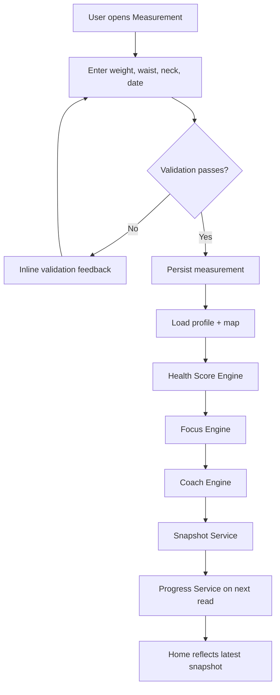

# NORDYAN Measurement Module v1.0

**Status:** Approved & Frozen — Measurement Module v1.0  
**Sprint:** 22 — Measurement Module Freeze & Architecture Status Reconciliation (**completed**)  
**Parent reference:** [NORDYAN Architecture v1.0](./NORDYAN_ARCHITECTURE_V1.md)  
**Last updated:** 2026-08-10

---

## 1. Purpose

The Measurement Module is the dedicated product surface and orchestration path for capturing **time-stamped health readings**. It completes the domain separation begun in NORDYAN Core v1.0. Profile `weight` / `waist` / `neck` remain **transitional** onboarding and Home fallback storage (see §7.1).

Within the NORDYAN platform, the module answers one question:

> **How does my health look today?**

Its role is to:

- capture a new measurement event with an explicit measurement date
- combine that event with stable profile inputs required by the health engines
- run the approved deterministic engine pipeline exactly once
- persist append-only snapshot history through SnapshotService
- refresh derived progress and Home presentation from canonical service output

The Measurement Module does not replace Profile, Snapshot, or Progress. It **feeds** them through a single approved workflow. It is the primary entry point for recurring health check-ins after onboarding.

This document is the **Approved & Frozen** specification for Measurement Module v1.0. Behavioral or contract changes require an explicit versioned change request and architecture review.

---

## 2. Product Principle

NORDYAN separates identity from health state over time.

> **A profile describes the person.**  
> **A measurement describes the person's health at a specific point in time.**

### Why Profile and Measurement are separate

| Concept | Describes | Changes | Examples |
|---------|-----------|---------|----------|
| **Profile** | who the user is | rarely | gender, birth year, height, activity level, goal |
| **Measurement** | what the body was at a moment | each capture event | weight, waist, neck, measurement date |

Separating these concepts prevents three architectural failures:

1. **History loss** — overwriting profile weight destroys the record of prior readings.
2. **Ambiguous recalculation** — engine input becomes unclear when profile fields silently change without a dated event.
3. **Product confusion** — Profile ("Who am I?") and Measurement ("How do I look today?") answer different user questions and must not share the same edit path.

Weight, waist, and neck are **not** ordinary Profile UI edits. Profile remains the source of stable engine inputs (identity/baseline). Append-only Measurement events are the source of time-varying body readings. After a successful measurement snapshot, Home uses the latest health snapshot as source of truth (see §7.1).

---

## 3. Goals

### Responsibilities

Measurement Module v1.0 is responsible for:

- a dedicated Measurement screen for capturing weight, waist, neck, and measurement date
- field-level and business-level validation before workflow execution
- a single Measurement Workflow that orchestrates engines and persistence
- creation of exactly one snapshot per successful measurement submission
- user feedback for success, validation failure, and recoverable system failure
- presentation of post-submit outcomes without UI-side health calculation

### Non-goals

Measurement Module v1.0 is **not** responsible for:

- modifying frozen engine formulas
- charts, timelines, or Health Journey views
- editing or deleting historical measurements
- external health integrations
- AI chat or generative coaching
- export or sharing
- sleep, steps, or device-derived metrics

### Success criteria

The module is successful when:

- a user can submit one measurement and receive one coherent health update across Home
- the same profile + measurement input always produces the same engine output
- onboarding and Home continue to consume canonical engine and service sources
- no screen calculates body fat, Health Score, focus, or coach output locally
- exactly one snapshot is written per successful measurement submission
- Progress on Home reflects the new snapshot on next load
- profile identity fields remain editable only through Profile, not through Measurement

---

## 4. User Journey

### Primary flow

The approved end-to-end path from user action to Home update:



### Linear pipeline guarantee

Each fully successful submission (`completed`) produces **one chain** of outcomes:

```
Validate
↓
Persist measurement
↓
Profile resolve + map
↓
Health Score Engine
↓
Focus Engine
↓
Coach Engine
↓
Snapshot Service (reason: measurement)
↓
Progress Service
↓
Home (latest snapshot)
```

No engine step in this chain may run twice for the same submission. Home does not recalculate from raw measurements; it reads snapshot-derived service output after a successful snapshot.

### Relationship to onboarding

Onboarding establishes the first profile baseline and may create the first snapshot through the existing onboarding sync path. After Measurement Module v1.0 is live, **recurring** health updates flow through Measurement, not Profile.

Onboarding remains frozen. Measurement Module must integrate with onboarding outcomes without redesigning onboarding navigation or engine contracts.

---

## 5. Screen Design

### Product question

The Measurement screen answers: **"How does my health look today?"**

### Layout

The screen uses the established NORDYAN visual language: dark surface cards, clear field hierarchy, primary action at the bottom, and safe-area-aware scrolling.

Recommended structure:

| Region | Content |
|--------|---------|
| Header | screen title and short explanatory subtitle |
| Form card | weight, waist, neck input fields with units |
| Date control | measurement date selector defaulting to today |
| Guidance | optional link to existing measurement help pattern |
| Primary action | submit measurement |
| Feedback area | validation messages, success confirmation, or recoverable error |

### Components

Presentation components only. No engine imports.

- numeric measurement fields consistent with onboarding measurement inputs
- date selector for measurement date
- primary submit button with loading/disabled states
- inline field errors
- optional success summary region showing formatted outcomes **after workflow completion** (not calculated in the screen)

### UX

- default measurement date is the user's local calendar date
- submit is disabled until required fields pass client-side shape validation
- loading state blocks duplicate submission
- success confirms that the measurement was saved and health was recalculated
- the user is not asked to interpret raw engine output; formatted summary copy comes from presentation services

### Navigation

- Measurement is a first-class product surface, distinct from Profile
- Entry: Health tab → measurement history (`app/(tabs)/health`) → **Ny mätning** (`app/(tabs)/health/new-measurement`)
- Successful submit presents inline success feedback; the user can return to history/Home
- Back navigation should not silently discard a valid in-progress form without confirmation if values were entered

---

## 6. Domain Model

### Measurement entity

Measurement is a **domain entity** representing one captured health reading event.

It is **not** a Snapshot. A Snapshot is derived engine output persisted after a successful workflow. A Measurement is the user's input event that triggers that workflow.

### Required fields

| Field | Type (conceptual) | Required | Notes |
|-------|-------------------|----------|-------|
| `id` | stable identifier | yes | assigned at persistence |
| `userId` | user reference | yes | owner |
| `measuredAt` | calendar date or timestamp | yes | explicit measurement date |
| `weightKg` | positive number | yes | body weight |
| `waistCm` | positive number | yes | waist circumference |
| `neckCm` | positive number | yes | neck circumference |
| `createdAt` | server timestamp | yes | record creation time |

Optional future fields (not v1.0): notes, source, device metadata.

### Relationships

```
User
└── Profile (1:1)
└── Measurements (1:n, append-only)
    └── triggers → Snapshot (0..1 per successful workflow run)
        └── feeds → Progress (derived)
```

- Measurement **belongs to** one user
- Measurement **uses** Profile fields as engine context (gender, date of birth, height, activity level)
- Measurement **may produce** one Snapshot when the workflow succeeds
- Snapshot **enables** Progress comparison on subsequent reads

### Lifecycle

1. **Draft** — user enters values locally; not persisted
2. **Submitted** — workflow started; duplicate submission prevented
3. **Persisted** — measurement record stored append-only
4. **Processed** — engines ran; snapshot created
5. **Readable** — Home and Progress consume updated service output

Measurements are **never updated or deleted** in v1.0. Corrections require a new measurement event.

### Ownership

| Concern | Owner |
|---------|-------|
| Measurement domain types + validation | `lib/domain/measurement/` |
| Measurement persistence (create) | `lib/repositories/*measurement*` |
| Measurement history reads | `lib/services/measurement/` |
| Measurement orchestration | `lib/application/measurement/` (`DefaultMeasurementWorkflow`) |
| Engine output history | SnapshotService |
| Progress comparison | ProgressService |
| Home current health presentation | `lib/services/home/` (snapshot-first) |

---

## 7. Architecture

### Responsibility boundaries

| Layer | Responsibility | Must not |
|-------|----------------|----------|
| **UI** (`app/(tabs)/health/*`, `components/measurement/`) | collect/display input; show validation and workflow status; format display copy | calculate health outcomes; call Supabase; call SnapshotService directly; duplicate measurement business rules |
| **Hooks** | call Measurement Workflow / MeasurementService; map typed outcomes to UI state | run engines; own persistence |
| **Measurement domain** | validate measurement field/business rules for the event | persist; run score/focus/coach formulas |
| **Measurement Workflow** | orchestrate validate → persist measurement → profile resolve → map → engines → snapshot; return typed outcomes | implement score/focus/coach formulas; expose PostgREST details to UI |
| **Health Score / Focus / Coach Engines** | sole deterministic decision logic for score, focus, recommendation | read/write database; import React |
| **Snapshot Service** | append-only snapshot insert and history read | run engines; format UI copy |
| **Progress Service** | derive latest-vs-previous summary from snapshot history | compare snapshots in UI; mutate snapshots |
| **Home** | present current score, progress, focus, coach from hooks/services (snapshot-derived when available) | calculate trends, body fat, or recommendations; read `measurements` for Home health math |

### Measurement Workflow (implemented orchestration)

The Measurement Workflow (`DefaultMeasurementWorkflow`) is the **single approved orchestrator** for measurement submission. It is the trigger for recurring weight/waist/neck updates after onboarding.

**Implemented sequence (authoritative):**

```
validate measurement input
→ persist measurement (append-only insert)
→ load / resolve profile
→ map profile + measurement → Health Score input
→ Health Score Engine (once)
→ Focus Engine (once)
→ Coach Engine (once)
→ persist health snapshot (reason: measurement)
→ return structured success or typed partial/failure to the hook layer
```

**Persist-first is intentional.** Persisting the measurement before engines/snapshot aligns with the Core **non-blocking snapshot** policy: a measurement event must not be lost because snapshot or engine orchestration failed.

#### Typed outcomes

| Outcome | Meaning |
|---------|---------|
| `completed` | Measurement and snapshot both persisted; `snapshotId` required |
| `measurement_persisted_snapshot_failed` | Measurement persisted; snapshot path failed (`profile_unavailable`, `profile_incomplete`, `pipeline_failed`, or `snapshot_persist_failed`) |
| `Result` error | Validation or unrecoverable persist failure; no success UX |

Partial success must surface honest UX: measurement saved; Home/progress may lag until a later successful snapshot.

### 7.1 Source of truth — transitional profile storage (v1.0)

| Concern | Source of truth |
|---------|-----------------|
| Append-only body measurement events | `measurements` table via Measurement repository |
| Home current score / weight / body fat / focus / coach (after successful measurement snapshot) | **Latest health snapshot** |
| Profile identity / baseline (gender, DOB, height, activity, goal) | `profiles` |
| Profile `weightKg` / `waistCm` / `neckCm` | **Transitional** onboarding and Home **profile_fallback** storage only |

Explicit v1.0 rules:

- Measurement submission **does not** mirror body values back into the profile.
- After a successful measurement snapshot, Home uses the latest health snapshot and does **not** re-read `measurements` for health math.
- If snapshot generation fails after measurement persist, profile fallback (or an older snapshot) may be **older** than the latest measurement row. This is accepted transitional architecture for v1.0.
- Removal or deprecation of profile body fields requires a later explicit ADR / milestone (reserved ADR-007).

### Integration with frozen Core v1.0

The following remain frozen and are consumed, not modified:

- Health Score Engine
- Focus Engine
- Coach Engine
- SnapshotService contract (caller uses approved `measurement` snapshot reason)
- ProgressService contract
- Home presentation contracts for Score, Progress, and Coach

Profile persistence remains the owner of identity fields. Measurement persistence owns time-stamped weight, waist, and neck events.

---

## 8. Dependency Rule

Dependencies may only point **downward**.

```
UI
↓
Hooks
↓
Application Workflows
↓
Domain Engines
↓
Persistence Services
↓
Supabase
```

### Allowed dependencies

- UI → Hooks → Measurement Workflow → Engines → Persistence → Supabase
- Presentation helpers may format values returned by workflows; they may not import engines directly from UI

### Forbidden dependencies

| Forbidden | Example |
|-----------|---------|
| UI imports Supabase | Measurement screen calling PostgREST |
| UI imports persistence services | screen calling SnapshotService directly |
| Domain imports React | engine using hooks |
| Domain imports Expo | engine using Expo modules |
| Persistence imports presentation | repository formatting Swedish trend copy |
| Engines import UI | engine importing a component |

Any architectural exception requires **explicit architecture review** and a documented ADR before implementation.

---

## 9. Validation Rules

### Field validation

Applied at the UI boundary for immediate feedback and re-validated in the workflow before engines run.

| Field | Rule |
|-------|------|
| `weightKg` | finite number > 0 |
| `waistCm` | finite number > 0 |
| `neckCm` | finite number > 0 |
| `measuredAt` | valid calendar date; not in the future |

Gender-specific Navy body fat prerequisites (e.g. waist relative to neck) are enforced by the Health Score Engine's existing validation rules. The workflow surfaces engine validation failures as user-readable messages.

### Business validation

Before workflow execution:

- user must be authenticated
- profile must be complete enough for engine input (gender, date of birth, height, activity level)
- no concurrent workflow run for the same submission
- measurement date must be accepted by domain policy (see Open Questions for same-day duplicates)

### User feedback

| Outcome | User experience |
|---------|-----------------|
| Field invalid | inline error on affected field; submit remains disabled or rejected |
| Full success (`completed`) | confirmation that measurement and health snapshot were saved |
| Partial success (`measurement_persisted_snapshot_failed`) | measurement saved; honest message that health snapshot could not be created (e.g. incomplete profile) |
| Recoverable persist failure | calm retry message; no raw database text |

### Failure handling

Field validation failures **stop before** measurement persist and engines. No measurement row and no snapshot are created.

After a measurement is persisted, snapshot/engine failures return typed **partial success** (`measurement_persisted_snapshot_failed`). They do not roll back the measurement row.

---

## 10. Snapshot Lifecycle

### When a snapshot is created

A snapshot with reason `measurement` is created when the Measurement Workflow completes the engine pipeline and SnapshotService insert successfully (`status: completed`).

Exact happy-path chain:

```
Validate measurement
↓
Persist measurement (append-only)
↓
Load profile + map to engine input
↓
One Health Score calculation
↓
One Focus calculation
↓
One Coach calculation
↓
One Snapshot insert (reason: measurement)
↓
One Progress update on next ProgressService read
↓
Home reads latest snapshot
```

### Duplication policy

| Scenario | Policy |
|----------|--------|
| Double tap submit | submit disabled while in flight; one workflow run |
| Retry after network failure | safe retry / idempotency policy still open (Open Question); avoid silent duplicate snapshots |
| Engine or snapshot failure after measurement persist | typed `measurement_persisted_snapshot_failed`; measurement kept; Home may lag |
| Validation failure | no measurement row; no snapshot |

### Snapshot reason

Approved reasons in use:

| Reason | When used |
|--------|-----------|
| `onboarding` | after onboarding profile sync |
| `profile_update` | after transitional profile-triggered snapshot path |
| `measurement` | after successful Measurement Workflow snapshot persist |

Existing schema also defines `weekly_checkin`; Measurement Module v1.0 does not use it.

---

## 11. Error Handling

### Validation failures

- **Cause:** invalid field values, missing profile context, future date
- **System behavior:** workflow stops before engines
- **User experience:** inline or screen-level message; no success state

### Workflow failures

- **Cause:** orchestration error, unexpected state, concurrent run
- **System behavior:** typed error returned to hook; dev logging in development builds
- **User experience:** generic retry message; form values preserved where safe

### Engine failures

- **Cause:** Health Score, Focus, or Coach engine returns validation or domain error
- **System behavior:** no snapshot; measurement persistence policy defined at implementation (see Open Questions)
- **User experience:** explain that health could not be calculated; do not show fabricated score

### Persistence failures

- **Cause:** Supabase/RLS/network error on measurement or snapshot write
- **System behavior:** typed integration error; detailed cause logged in dev
- **User experience:** no raw PostgREST messages; actionable retry guidance

### Snapshot failures

- **Cause:** snapshot insert failed after successful engine run
- **System behavior:** aligned with Core v1.0 policy — snapshot failure must not falsely report a successful measurement save as failed if measurement persistence succeeded; error logged for remediation
- **User experience:** user informed that history sync may be delayed; Home may show prior progress until snapshot exists

---

## 12. UX Principles

| Principle | Meaning |
|-----------|---------|
| **Simple** | one screen, one primary action, minimal cognitive load |
| **Safe** | validation before calculation; no destructive actions |
| **Predictable** | same input → same engine output → same Home reading |
| **Append-only history** | measurements and snapshots accumulate; past events are not rewritten |
| **No destructive editing** | users add new measurements; they do not overwrite history |

### Guiding principle

> **A measurement is an event, not an edit.**

The UI language, navigation, and persistence model must reinforce event capture: "Add today's measurement," not "Update my weight on my profile."

---

## 13. Future Extensions

The architecture is intentionally designed for extension without breaking v1.0 contracts.

Possible future additions:

| Extension | Notes |
|-----------|-------|
| Hip measurement | new field + engine input extension via versioned change |
| Blood pressure | separate metric family; likely separate entity or typed measurement variant |
| Resting heart rate | integration or manual entry |
| Body composition | device-derived; integration layer feeds Measurement or parallel entity |
| Apple Health | read-only or write-back via integration adapter |
| Health Connect | Android equivalent |
| Smart scales | automated measurement ingestion with source metadata |

Extensions must enter through:

- domain type versioning
- persistence migration
- workflow orchestration update
- architecture review

They must not bypass engines or write snapshots from UI.

---

## 14. Risks

| Risk | Impact | Mitigation |
|------|--------|------------|
| **Duplicate snapshots** | incorrect progress and history | single workflow entry point; submit guard; idempotency policy at implementation |
| **Duplicate score calculations** | inconsistent Home vs Measurement summary | engines invoked only inside Measurement Workflow |
| **Multiple workflow execution** | race on double submit | disable submit while in flight; workflow-level concurrency guard |
| **UI-side calculations** | drift from Home and onboarding | presentation-only UI; architecture review gate |
| **Profile misuse** | weight/waist/neck edited via Profile after module launch | Profile UI no longer edits body fields; keep service-level body writes limited to onboarding/transitional paths |
| **Transitional dual paths** | onboarding/profile_update and measurement both write snapshots | accepted for v1.0; deprecate profile body path via later ADR-007 milestone |
| **Snapshot failure masking** | user believes progress updated when snapshot missing | honest partial-success UX (`measurement_persisted_snapshot_failed`); logging; retry policy |

---

## 15. Non-goals

Measurement Module v1.0 explicitly excludes:

- charts and graphs
- timeline or Health Journey surfaces
- Score Timeline visualization
- AI chat or conversational coaching
- data export
- Apple Health, Health Connect, Garmin, or other integrations
- editing or deleting past measurements
- progress photos or user notes
- weekly check-in flows (unless later merged by approved change request)
- modification of frozen engine logic

---

## 16. Definition of Done

### Sprint 22 — completed

- [x] specification reconciled to implemented Measurement Module v1.0
- [x] workflow order and partial-success contract documented
- [x] transitional profile body storage documented as accepted v1.0 architecture
- [x] `npx tsc --noEmit` — **PASS**
- [x] Expo Go smoke: Health → Ny mätning → persist → Home score/progress/coach — **PASS**
- [x] architecture review completed — no blockers
- [x] **Approved & Frozen — Measurement Module v1.0**

Sprint 22 did not change application code, schema, deploy configuration, or AI coach surfaces.

---

## 17. Open Questions

Resolved in implementation (recorded for history):

| Topic | Resolution |
|-------|------------|
| Measurement persistence before snapshot | **Persist-first**; typed `measurement_persisted_snapshot_failed` |
| Snapshot reason enum | **`measurement`** (schema + domain) |

Still deferred to later milestones:

| Question | Considerations |
|----------|----------------|
| Prefill last measurement? | reduces friction vs implies endorsement of prior values |
| Multiple measurements per day? | snapshot duplication policy; progress semantics |
| Edit vs delete historical measurements? | conflicts with append-only principle; deferred in v1.0 |
| User notes on a measurement? | scope creep vs coaching context |
| Progress photos? | separate media module; not v1.0 |
| Safe retry after snapshot failure | idempotency key vs duplicate detection |
| Deprecation timeline for profile body fields | reserved ADR-007 |
| Post-submit navigation polish | inline success vs redirect to Home |

None of these open questions block documenting or freezing Measurement Module v1.0 as implemented.

---

## 18. Architecture Decision Records (ADR)

### ADR-001 — Profile and Measurement are separate concepts

**Decision:** Profile stores identity and stable baseline inputs. Measurement stores time-stamped weight, waist, and neck events.

**Rationale:** preserves history, clarifies product surfaces, prevents silent overwrites.

**Status:** Approved

---

### ADR-002 — Measurements are append-only

**Decision:** Measurement records are inserted, not updated or deleted in v1.0.

**Rationale:** health history must be auditable; progress and future journey views depend on immutable events.

**Status:** Approved

---

### ADR-003 — Health engines are deterministic

**Decision:** Health Score, Focus, and Coach engines remain pure and frozen; Measurement Workflow invokes them unchanged.

**Rationale:** reproducibility, test vectors, consistent Home and Measurement outcomes.

**Status:** Approved

---

### ADR-004 — UI is presentation-only

**Decision:** Measurement screen and Home never calculate body fat, score, trends, focus, or coach output.

**Rationale:** single source of truth; prevents surface drift.

**Status:** Approved

---

### ADR-005 — Measurement Workflow orchestrates but never calculates

**Decision:** all health math lives in domain engines; the workflow sequences validation, engine calls, and persistence only.

**Rationale:** clear boundary between orchestration and domain logic; one front door for submission.

**Status:** Approved

---

### ADR-006 — Measurement snapshot reason

**Decision:** Successful Measurement Workflow snapshots use `snapshot_reason = 'measurement'`.

**Rationale:** distinguishes measurement-driven history from onboarding / profile_update paths.

**Status:** Approved & Frozen (with Measurement Module v1.0)

---

### Future ADRs (reserved)

- ADR-007 — Deprecation of transitional profile body-field storage / updates
- ADR-008 — Idempotency and retry policy after snapshot failure
- ADR-009 — Multiple measurements per day policy

---

## 19. Known non-blocking cleanup debt

The following items are **not** freeze blockers for Measurement Module v1.0. They may be cleaned up in a later patch milestone:

| Debt | Location | Notes |
|------|----------|-------|
| Stale “future milestone” comment on validation contract | `lib/domain/measurement/measurement.validation.ts` | Rules are already implemented in `measurement.validator.ts` |
| Unused `measurement_persisted` workflow variant | `lib/application/measurement/measurement.workflow.types.ts` | Live workflow returns `completed` or `measurement_persisted_snapshot_failed` |

---

## Document Status

> **Approved & Frozen — Measurement Module v1.0**

**Sprint 22:** Completed (architecture verification, documentation reconciliation, TypeScript PASS, Expo Go PASS, final freeze).

Frozen means: bug fixes allowed; behavior or contract changes require an explicit versioned change request and architecture review. Non-blocking cleanup debt in §19 may be addressed in a later patch milestone without unfreezing the product contract.
